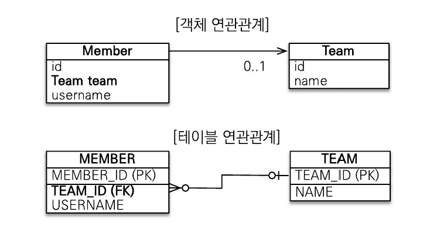
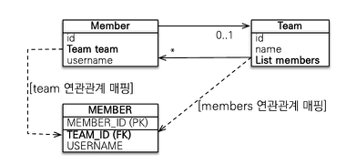
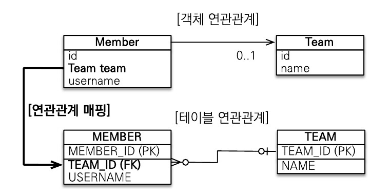
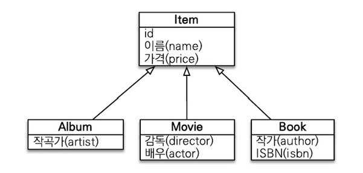
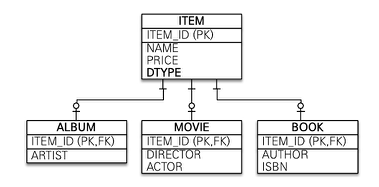
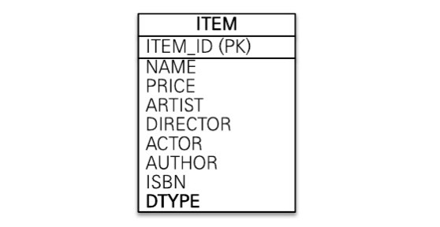
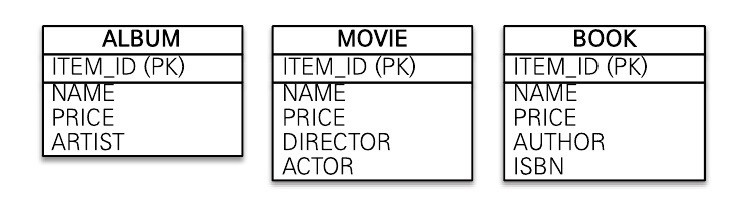

## 엔티티 연관관계

### 단방향 연관관계
- 두 엔티티가 있을 때 한 쪽에서만 다른 엔티티를 참조하는 관계
- 단방향 연관관계는 객체관계에서만 존재하고 테이블 관계는 항상 양방향  
    
  - Member 객체는 team 필드로 Team 객체를 참조하지만 Team 객체는 member 를 참조하지 않는 상태

### 양방향 연관관계
- 두 엔티티가 있을 때 양쪽에서 서로 반대편의 엔티티를 참조하는 관계  
  

## 객체 관계 매핑
### @ManyToOne (N : 1)
  
- 참조하는 엔티티와 N : 1 관계일 때 사용하는 애너테이션
  ```java
  @Entity
  public class Member {
  
    @Id
    @GeneratedValue(strategy = GenerationType.AUTO)
    private Long id;
    private String username;
  
    @ManyToOne(fetch = FetchType.LAZY)
    private Team team;
  
    private void setTeam(Team team) {
      this.team = team;
    }
  }
  
  @Entity
  public class Team {
  
    @Id
    @GeneratedValue(strategy = GenerationType.AUTO)
    private Long id;
    private String teamName;
  }
  ```
- @ManyToOne 의 프로퍼티
  - fetch
    - FetchType.LAZY
      - 참조하는 엔티티 데이터 조회시 지연로딩을 적용한다.
    - FetchType.EAGER
      - 참조하는 엔티티에 즉시로딩을 적용한다. 엔티티 데이터 조회시에 참조 엔티티를 자동으로 추가로 조회한다.
      - 의도치않게 불필요한 참조 엔티티를 조회할 수 있으므로 EAGER 보다는 LAZY 로 설정하는 것을 권장한다.

### @OneToMany (1 : N)
- 참조하는 엔티티와 1 : N 관계일 때 사용하는 애너테이션
  ```java
  @Entity
  public class Member {
  
    @Id
    @GeneratedValue(strategy = GenerationType.AUTO)
    private Long id;
    private String username;
  
    // 연관관계의 주인. 연관된 team 을 등록, 변경, 삭제할 수 있다.
    @ManyToOne(fetch = FetchType.LAZY)
    private Team team;
  
    private void setTeam(Team team) {
      this.team = team;
    }
  }
  
  @Entity
  public class Team {
  
    @Id
    @GeneratedValue(strategy = GenerationType.AUTO)
    private Long id;
    private String teamName;
  
    // 연관관계의 주인이 아닌 쪽은 읽기만 가능
    @OneToMany(mappedBy = "team")   // 연관관계의 주인을 Member.team 으로 지정
    private List<Member> members = new ArrayList<>();
  }
  ```
  
- @OneToMany 의 프로퍼티
  - mappedBy
    - 연관관계의 주인을 정하는 속성
    - 연관관계의 주인이 아닌 쪽은 읽기만 할 수 있다.

### @OneToOne (1 : 1)
- 참조하는 엔티티와 1 : 1 관계일 때 사용하는 애너테이션
    ```java
    @Entity
    public class Member {
  
        @Id
        @GeneratedValue(strategy = GenerationType.AUTO)
        private Long id;
        private String username;
  
        @OneToOne
        private Locker locker;
  
        public void setLocker(Locker locker) {
            this.locker = locker;
        }
    }
  
    @Entity
    public class Locker {
  
        @Id
        @GeneratedValue(strategy = GenerationType.AUTO)
        private Long id;
        private String name;
  
        // 양방향 연관관계 시에는 연관관계의 주인을 Member.locker 로 지정
        // 해당 필드는 읽기만 가능
        @OneToOne(mappedBy = "locker")
        private Member member;
  
    }
  ```

### 순수한 객체를 고려한 양방향 연관관계
  - 객체 관점에서 양방향 연관관계 시에는 양쪽 방향에 모두 값을 입력해주는 것이 안전함
  - 양방향 연관관계시 데이터의 정합성을 위해 연관관계 편의 메서드를 작성한다.
      ```java
      @Entity
      @Getter
      public class Member {

          @Id
          @GeneratedValue(strategy = GenerationType.AUTO)
          private Long id;
          private String username;

          @ManyToOne(fetch = FetchType.LAZY)
          private Team team;

          // 연관관계 편의 메서드
          private void setTeam(Team team) {
              // 기존에 다른 팀에 속해있었다면 그 관계를 제거
              if (this.team != null) {
                  this.team.getMembers().remove(this);
              }
  
              this.team = team;
              team.getMembers().add(this);
          }
      }

      @Entity
      @Getter
      public class Team {

          @Id
          @GeneratedValue(strategy = GenerationType.AUTO)
          private Long id;
          private String teamName;

          @OneToMany(mappedBy = "team")
          private List<Member> members = new ArrayList<>();
      }
      ```
    
## 상속 관계 매핑
- 객체의 상속 구조와 데이터베이스의 슈퍼 / 서브타입 관계를 매핑  
    
- 구현 방식에 따라 여러 전략이 있어 상황에 맞게 선택한다.
  - 조인 전략
  - 단일 테이블 전략
  - 구현 클래스마다 테이블 생성

### 조인 전략  
  
- 엔티티 각각을 모두 테이블로 만들고 자식 테이블이 부모 테이블의 기본 키를 받아서
  해당 키를 기본 키 + 외래 키로 사용하는 전략
- 조회할 때에는 조인을 사용하여 부모 + 자식 데이터를 조회함
```java
@Entity
@Inheritance(strategy = InheritanceType.JOINED)
@DiscriminatorColumn(name = "DTYPE")    // name 을 지정하지 않을 경우 DTYPE 으로 기본 값이 지정됨
public abstract class Item {

    @Id
    @GeneratedValue
    private Long id;

    private String name;
    private int price;
}

@Entity
@DiscriminatorValue("ALBUM")
public class Album extends Item {

  private String artist;
}

@Entity
@DiscriminatorValue("MOVIE")
public class Movie extends Item {

  private String director;
  private String actor;
}

@Entity
@DiscriminatorValue("BOOK")
public class Book extends Item {

  private String author;
  private String isbn;
}
```
- 조인 전략의 장단점
  - 장점
    - 테이블이 정규화된다.
    - 외래 키 참조 무결성 제약조건을 활용할 수 있다.
    - 저장공간을 효율적으로 사용
  - 단점
    - 조회할 때 조인이 많이 사용되어 성능이 저하될 수 있다.
    - 조인이 사용되므로 조회 쿼리가 복잡해진다.
    - 데이터를 등록할 때 부모 / 자식 테이블에 총 Insert SQL 이 두 번 실행된다.

### 단일 테이블 전략  
  
- 하나의 테이블만 사용하는 전략
- 자식 엔티티에 따라 null 인 컬럼이 발생할 수 있으므로 자식 엔티티가 매핑한 컬럼은 모두 null 을 허용해야 함
```java
@Entity
@Inheritance(strategy = InheritanceType.SINGLE_TABLE)
@DiscriminatorColumn(name = "DTYPE")    // name 을 지정하지 않을 경우 DTYPE 으로 기본 값이 지정됨
public abstract class Item {

    @Id
    @GeneratedValue
    private Long id;

    private String name;
    private int price;
}

@Entity
@DiscriminatorValue("ALBUM")
public class Album extends Item {

  private String artist;
}

@Entity
@DiscriminatorValue("MOVIE")
public class Movie extends Item {

  private String director;
  private String actor;
}

@Entity
@DiscriminatorValue("BOOK")
public class Book extends Item {

  private String author;
  private String isbn;
}
```
- 단일 테이블 전략의 장단점
  - 장점
    - 조회시 조인이 필요없으므로 조회 성능이 빠르다.
    - 조회 쿼리가 단순하다.
  - 단점
    - 자식 엔티티가 매핑한 컬럼은 모두 null 을 허용해야한다.
    - 컬럼 수가 커지고 테이블 자체가 커져 상황에 따라서는 조회성능이 저하될 수 있다.

### 구현클래스마다 테이블 생성  
  
- 자식 엔티티마다 테이블을 생성, 테이블 각각에 필요한 컬럼들을 생성
- 조인전략, 단일테이블 전략에 비해 추천되지 않는 전략
```java
@Entity
@Inheritance(strategy = InheritanceType.TABLE_PER_CLASS)
public abstract class Item {

    @Id
    @GeneratedValue
    private Long id;

    private String name;
    private int price;
}

@Entity
public class Album extends Item {

  private String artist;
}

@Entity
public class Movie extends Item {

  private String director;
  private String actor;
}

@Entity
public class Book extends Item {

  private String author;
  private String isbn;
}
```
- 구현클래스마다 테이블 생성 전략의 장단점
  - 장점
    - 서브타입을 구분해서 처리할 떄 효과적
    - not null 제약조건을 사용할 수 있다.
  - 단점
    - 여러 자식 테이블을 함께 조회할 때 성능이 느리다.
      - SQL 조회시 UNION 을 사용해서 조회해야 한다.
    - 자식 테이블을 통합해서 쿼리하기가 어렵다.