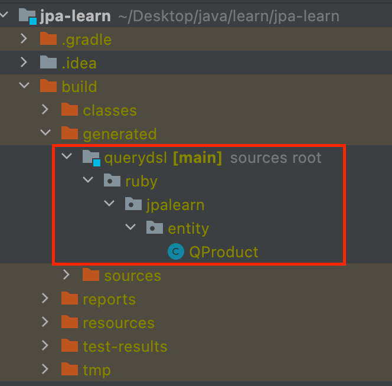

## QueryDSL
- 정적 타입을 이용해서 SQL 등의 쿼리를 생성해주는 프레임워크
- JPQL 빌더 역할을 수행


### QueryDSL Gradle 설정
```gradle
buildscript {
    ext {
        queryDslVersion = "5.0.0"
    }
}

plugins {
    id "com.ewerk.gradle.plugins.querydsl" version "1.0.10"
}

group = 'ruby'
version = '0.0.1-SNAPSHOT'
sourceCompatibility = '11'

configurations {
    compileOnly {
        extendsFrom annotationProcessor
    }
    querydsl.extendsFrom compileClasspath
}

def querydslDir = "$buildDir/generated/querydsl"

dependencies {

    // JPA
    implementation 'org.springframework.boot:spring-boot-starter-data-jpa'
    // queryDsl
    implementation "com.querydsl:querydsl-jpa:${queryDslVersion}"
    implementation "com.querydsl:querydsl-apt:${queryDslVersion}"

}

querydsl {
    jpa = true
    querydslSourcesDir = querydslDir
}
sourceSets {
    main.java.srcDir querydslDir
}
compileQuerydsl{
    options.annotationProcessorPath = configurations.querydsl
}

```

### JPAQueryFactory 빈 등록
- JPAQueryFactory 는 entityManager 를 통해 생성한 JPQL 을 처리
```java
@Configuration
public class QueryDslConfig {

    @PersistenceContext
    private EntityManager entityManager;

    /** JPAQueryFactory 를 빈으로 등록 */
    @Bean
    public JPAQueryFactory jpaQueryFactory() {
        return new JPAQueryFactory(entityManager);
    }
}
```

### QClass 생성
- QueryDSL 을 통해 엔티티 데이터를 조회하기 위해서는 QClass 가 필요하다.
- QClass 는 엔티티를 기반으로 컴파일 후 생성된다.
    

### QueryDSL 작성
- JpaRepository 를 상속받지 않고 단독으로 사용
    ```java
    @RequiredArgsConstructor
    @Repository
    public class ProductRepository {
    
        private final JPAQueryFactory queryFactory;
        
        public Optional<Product> findProducts(Long id) {
            return Optional.ofNullable(
                        queryFactory
                                .selectFrom(product)
                                .fetchOne()
                    );
        }
    }
    ```

- JpaRepository 를 상속받아 JpaRepository 가 제공받은 기능을 함께 사용할 경우
  - ~Custom, ~Impl 네이밍 규칙을 반드시 지켜야한다.
    ```java
    public interface ProductRepository extends JpaRepository<Product, Long>, ProductRepositoryCustom {
    
    }
    
    public interface ProductRepositoryCustom {
    }
    
    @RequiredArgsConstructor
    public class ProductRepositoryImpl implements ProductRepositoryCustom{
    
        private final JPAQueryFactory jpaQueryFactory;
    }
    ```

### QueryDSL 조회
- SELECT
    ```java
    @RequiredArgsConstructor
    public class ProductRepositoryImpl implements ProductRepositoryCustom {
    
        private final JPAQueryFactory jpaQueryFactory;
    
        // fetch - 목록 조회
        @Override
        public List<Product> findProducts() {
            return jpaQueryFactory
                    .selectFrom(QProduct.product)
                    .fetch();
        }
    
        // fetchOne - 단 건 조회
        @Override
        public Optional<Product> findByName(String name) {
            return Optional.ofNullable(
                    jpaQueryFactory
                            .selectFrom(QProduct.product)
                            .where(QProduct.product.name.contains(name))
                            .fetchOne()
            );
        }
    }
    ```
  
- WHERE
  - 조건에는 and, or, not 를 사용할 수 있으며 필드는 contains, between 등의 메소드를 통해 조건을 적용할 수 있다.
      ```java
      @RequiredArgsConstructor
      public class ProductRepositoryImpl implements ProductRepositoryCustom {
    
          private final JPAQueryFactory jpaQueryFactory;
        
          @Override
          public Optional<Product> findByName(String name) {
              return Optional.ofNullable(
                      jpaQueryFactory
                              .selectFrom(QProduct.product)
                              .where(QProduct.product.name.contains(name))
                              .fetchOne()
              );
          }
      }
      ```
    
- 페이징 및 정렬
  - offset, limit 을 통해 페이징 조회를 할 수 있다.
  - orderBy 를 통해 정렬하여 조회할 수 있다.
    ```java
    @RequiredArgsConstructor
    public class ProductRepositoryImpl implements ProductRepositoryCustom{
    
        private final JPAQueryFactory jpaQueryFactory;
    
        @Override
        public List<Product> findProducts() {
            return jpaQueryFactory
                    .selectFrom(QProduct.product)
                    .orderBy(QProduct.product.id.desc())
                    .offset(30)
                    .limit(10)
                    .fetch();
        }
    }
    ```
    
- GROUP BY / HAVING
  - groupBy, having 을 통해 통계 결과를 조회할 수 있다.
    ```java
    @RequiredArgsConstructor
    public class ProductRepositoryImpl implements ProductRepositoryCustom{
  
        private final JPAQueryFactory jpaQueryFactory;
  
        @Override
        public List<Integer> getSumPriceByTypes() {
             return jpaQueryFactory
                    .select(QProduct.product.price.sum())
                    .from(QProduct.product)
                    .groupBy(QProduct.product.productType)
                    .having(QProduct.product.price.sum().gt(100000))
                    .fetch();
        }
    }
    ```
    
- JOIN
  - join(innerJoin), leftJoin, rightJoin 및 성능 최적화를 위한 JPQL 의 fetchJoin 을 사용할 수 있다.
    ```java
    @RequiredArgsConstructor
    public class ProductRepositoryImpl implements ProductRepositoryCustom{
  
        private final JPAQueryFactory jpaQueryFactory;
  
        // Product 와 Seller 를 LeftJoin 및 FetchJoin 하여 조회
        @Override
        public List<Product> findProductsAndSellers() {
            return jpaQueryFactory
                    .selectFrom(QProduct.product)
                    .leftJoin(QProduct.product.seller, QSeller.seller).fetchJoin()
                    .fetch();
        }
    }
    ```
    
- 서브 쿼리
  - where, select 에 서브쿼리를 작성하여 조회할 수 있다.
    - QueryDSL 은 결과적으로 JPQL 을 생성하기 때문에 from 절에 서브쿼리를 작성할 수 없다.
    ```java
    @RequiredArgsConstructor
    public class ProductRepositoryImpl implements ProductRepositoryCustom{
  
        private final JPAQueryFactory jpaQueryFactory;
  
        @Override
        public List<Product> findProductsByAvgPrice() {
            return jpaQueryFactory
                    .selectFrom(QProduct.product)
                    .where(
                            QProduct.product.price.gt(
                                    JPAExpressions
                                            .select(QProduct.product.price.avg())
                                            .from(QProduct.product)
                                            .fetchOne()
                            )
                    )
                    .fetch();
        }
    }
    ```
    
- Projection
  - select 절에 조회 대상을 지정하여 조회
  - 프로젝션 대상이 하나일 경우
    ```java
    @RequiredArgsConstructor
    public class ProductRepositoryImpl implements ProductRepositoryCustom{
  
        private final JPAQueryFactory jpaQueryFactory;
        @Override
        public List<String> findProductNames() {
            return jpaQueryFactory
                    .select(QProduct.product.name).distinct()
                    .from(QProduct.product)
                    .fetch();
        }
    }
    ```
- 여러 컬럼일 경우 특정 객체를 통해 조회 결과를 받을 수 있다.
  - 튜플로 받을 수도 있지만 특정 타입을 생성하여 해당 타입으로 받는 것을 추천
  ```java
  @RequiredArgsConstructor
  public class ProductRepositoryImpl implements ProductRepositoryCustom{
  
      private final JPAQueryFactory jpaQueryFactory;
  
      @Override
      public List<ProductDto> findProductsNameAndSellerEmail() {
          return jpaQueryFactory
                  .select(new QProductDto(QProduct.product.name, QSeller.seller.email))
                  .from(QProduct.product)
                  .leftJoin(QProduct.product.seller, QSeller.seller)
                  .fetch();
      }
  }
  ```