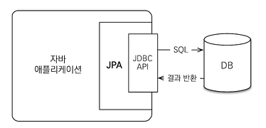
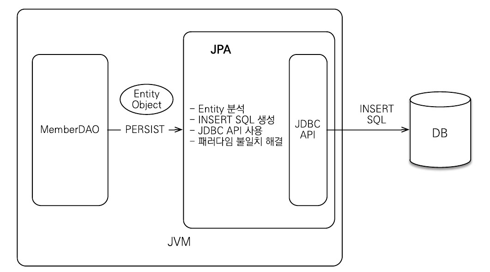
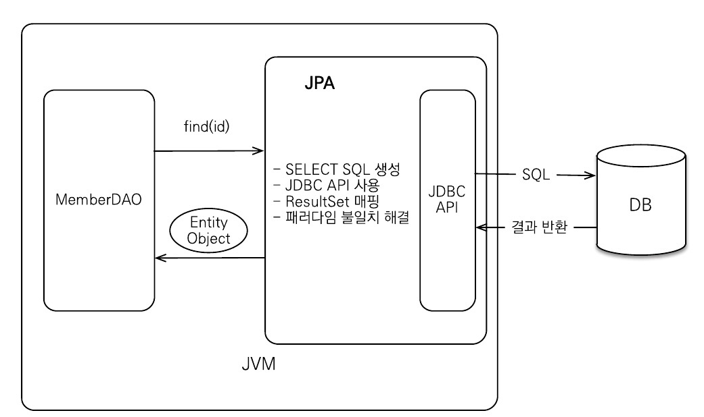
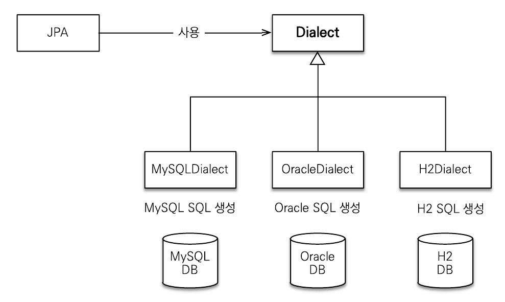

## JPA - Java Persistence API
- 자바 진영의 ORM 표준 기술 명세
  - JPA 를 구현한 ORM 프레임워크는 여럿 있지만 hibernate 가 가장 대중적으로 사용됨
- 애플리케이션과 JDBC 사이에서 동작  
  

### ORM - Object Relation Mapping
- 객체와 관계형 데이터베이스를 매핑해주는 프레임워크
    
    
- 객체와 SQL Relation 간의 패러다임 불일치 문제를 해결해줌

### JPA 의 사용 이유
- 생산성
  - JPA 를 사용하면 자바 컬렉션을 다루듯 저장, 변경, 삭제 등을 처리할 수 있다.
    - SQL 작성 및 JDBC API 를 직접 작성하지 않아도 됨
  - 데이터베이스 설계 중심의 패러다임으로부터 벗어나 객체 설계 중심으로 작업이 가능
- 유지보수
  - 개발자가 작성한 SQL 과 JDBC API 를 JPA 가 대신 처리해주므로 유지보수해야 하는 코드 수가 줄어듬
  - 객체지향 언어가 가진 장점들을 활용해서 유연하고 유지보수하기 좋은 도메인 모델을 편리하게 설계할 수 있음
- 패러다임의 불일치 해결
  - Relation 간의 관계를 객체간의 관계로 다룰 수 있으므로 상속, 연관관계, 객체 그래프 탐색, 객체 비교 등을 활용할 수 있음
- 성능
  - JPA 는 애플리케이션과 데이터베이스 사이에서 다양한 성능 최적화 기회를 제공
  - 애플레케이션과 데이터베이스 사이의 계층을 통해 데이터 캐싱 등의 기능을 제공함
- 데이터 접근 추상화와 벤더 독립성
  - JPA 는 애플리케이션과 데이터베이스 사이에 추상화된 데이터 접근 계층을 제공함으로서 애플리케이션이 특정 데이터베이스 기술에 
  종속되지 않도록 해준다.  
    
- 표준
  - 자바 진영의 ORM 기술 표준으로서 다른 구현 기술로 손쉽게 변경 가능