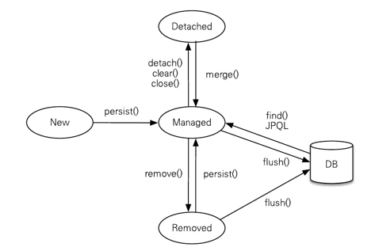
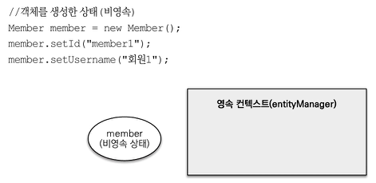
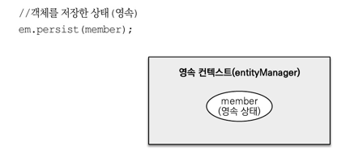
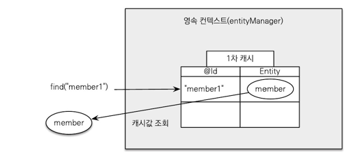
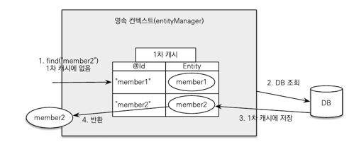
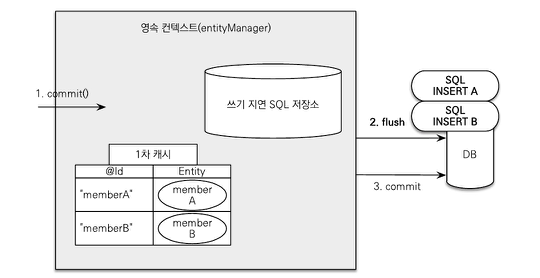

## 영속성 컨텍스트 - Persistence Context
- 엔티티를 영구 저장하는 환경
- 엔티티 매니저로 엔티티를 저장하거나 조회할 때 엔티티 매니저는 영속성 컨텍스트에 엔티티를 보관하고 관리함
  - 앤티티 매니저를 생성할 때 만들어짐
- 데이터베이스 연결이 꼭 필요한 시점에 DB 커넥션 풀로부터 커넥션을 얻어 데이터를 처리  
  

### Entity Manager
- 엔티티를 관리하는 관리자. 엔티티를 저장, 수정, 삭제, 조회하는 등 엔티티와 관련된 모든일을 처리
- 여러 쓰레드가 동시에 접근하면 동시성 문제가 발생할 수 있으므로 쓰레드 간에 절대 공유되어서는 안 됨
- Entity Manager Factory
  - 엔티티 매니저를 생성하는 팩토리
  - 팩토리를 생성하는 비용이 크기 때문에 일반적으로 애플리케이션 전체에서 하나만 생성하여 공유하도록 설계되어 있음  

### Entity 의 생명주기
  
- 비영속  
    
  - 영속성 컨텍스트와 전혀 관계가 없는 상태
  - 엔티티 객체를 생성 후 저장하지 않은 순수한 객체 상태
    - 영속성 컨텍스트 및 데이터베이스와는 전혀 연관이 없는 상태
- 영속  
    
  - 영속성 컨텍스트에 저장된 상태
  - 엔티티 매니저를 통해 엔티티 매니저를 영속성 컨텍스트에 저장, 영속성 컨텍스트가 관리하는 상태
  - DB 에서 조회한 엔티티 또한 영속성 컨텍스트에 의해 관리되는 영속 상태이다.
- 준영속
  - 영속성 컨텍스트에 저장되었다가 분리된 상태
  - entityManager.detach() 를 호출하여 영속 상태의 엔티티를 준영속 상태로 변경할 수 있다.
    - 준영속 상태의 엔티티는 식별자 값은 가지고 있지만 영속성 컨텍스트에 의해 관리되지 않으므로 변경감지 및 지연로딩이 동작하지 않는다.
  - entityManager.close() 호출을 통해 영속성 컨텍스트를 닫거나 entityManager.clear() 호출을 통해 영속성 컨텍스트를 초기화하면
  영속성 컨텍스트가 관리하던 모든 엔티티는 준영속 상태가 된다.
- 삭제
  - 삭제된 상태
  - 엔티티 및 매핑된 Relation 을 영속성 컨텍스트와 데이터베이스에서 삭제

### 영속성 컨텍스트의 특징
- 엔티티를 식별자 값으로 구분. 따라서 영속 상태의 엔티티는 반드시 식별자 값이 있어야 한다.
  - 식별자
    - 엔티티 클래스의 필드 중 @Id로 테이블의 기본 키와 매핑한 값
- 엔티티 데이터의 데이터베이스 저장 시점
  - 일반적으로 JPA 는 트랜잭션을 커밋하는 순간 영속성 컨텍스트에 새로 저장 및 변경된 엔티티를 데이터베이스에 반영
- 영속성 컨텍스트가 엔티티를 관리하면서 얻는 장점
  - 1차 캐시
    - 조회하려는 데이터가 영속성 컨텍스트에 있을 경우 DB 에서 조회하지 않고 영속성 컨텍스트에 있는 엔티티를 반환하여 DB 커넥션을 줄여줌  
        
    - 조회하려는 데이터가 영속성 컨텍스트에 없을 경우 DB 에서 조회하여 해당 데이터를 1차 캐시에 저장한 후 데이터를 반환  
      
  - 동일성 보장
    - 같은 Relation 을 매핑한 엔티티는 같은 객체임을 보장함(==)
  - 트랜잭션을 지원하는 쓰기 지연
    - Insert 및 Update 를 바로 처리하지 않고 쿼리들을 모아두었다가 트랜잭션이 커밋되거나 변경된 결과를 조회하는 시점에 한 번에 처리함으로서 DB 커넥션을 줄여줌
  - 변경 감지
    - 영속성 컨텍스트에 의해 관리되는 영속 상태의 엔티티의 변경을 감지하여 변경된 내용을 DB 에 반영해줌  
        
      1. JPA 는 엔티티를 영속성 컨텍스트에 보관할 때, 최초 상태를 복사해서 저장해 둠(스냅 샷)
      2. flush 시점에 스냅샷과 엔티티를 비교해서 변경된 엔티티를 찾는다.
      3. 변경된 엔티티가 있다면 수정 쿼리를 생성하여 쓰기 지연 SQL 저장소에 보낸다.
      4. 쓰기 지연 저장소의 SQL 을 데이터베이스에 보낸다.
      5. 데이터베이스 트랜잭션을 커밋한다.
  - 지연로딩
    - 엔티티와 연관 관계에 있는 다른 엔티티를 실제 사용할 때까지(필요한 시점까지) 데이터 로딩을 미루어 둔다.
      - 연관 관계에 있는 엔티티의 데이터가 실제 필요한 시점에 데이터베이스에서 조회