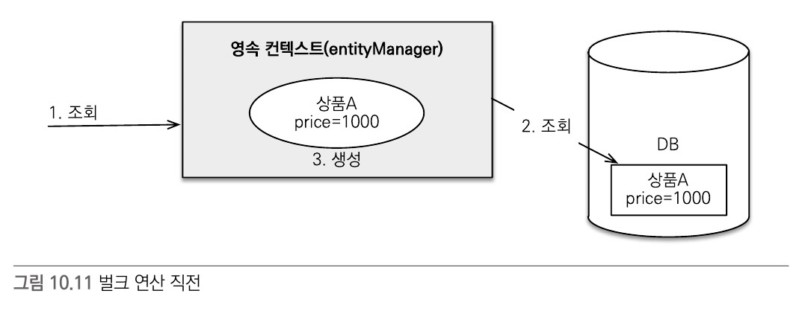

## JPQL - Java Persistence Query Language
- 엔티티 객체를 조회하는 객체지향 쿼리
  - JPQL 은 테이블을 대상으로 쿼리하는 것이 아니라 엔티티 객체를 대상으로 쿼리한다.
- SQL 과 문법이 비슷하며 ANSI 표준 SQL 이 제공하는 기능을 유사하게 지원
- JPQL 은 SQL 을 추상화해서 특정 데이터베이스에 의존하지 않는다.
```java
String jpql = "select m from Member as m where m.username = 'kim'";
List<Member> members = em.createQuery(jpql, Member.class).getResultList();
```
```sql
-- 실행된 JPQL
select  m
from    Member as m
where   m.username = 'kim'

-- 실행된 SQL
select  member.id as id,
        member.age as age,
        member.team_id as team,
        member.name as name
from    Member member
where   member.name = 'kim'
```

### Projection
- Select 조회시 조회할 대상을 지정하여 조회하는 것
  - 엔티티 프로젝션
    - 엔티티를 대상으로 지정하여 조회할 경우 조회한 엔티티는 영속성 컨텍스트에서 관리된다.
    - 엔티티를 조회할 경우에는 스프링 데이터 JPA 를 활용하므로 잘 사용되지는 않는다.
  - 임베디드 타입 프로젝션
    - 엔티티 프로젝션과 비슷하게 임베디드 타입으로 조회할 수 있다.
      - 임베디드 타입에 매칭되는 테이블이 없으므로 임베디드 타입을 사용하는 엔티티를 기준, from 절에 명시하여 조회한다.
      - 임베디드 타입은 엔티티 타입이 아니므로 조회결과는 영속성 컨텍스트에서 관리되지 않는다.
      ```java
      public interface ProductRepository extends JpaRepository<Product, Long> {

        @Query("select p.address from Product p")
        List<Address> findAllAddress();
      }
      ```
  - 스칼라 타입 프로젝션
    - 숫자, 문자, 날짜와 같은 기본 데이터 타입의 데이터를 조회
    ```java
    public interface ProductRepository extends JpaRepository<Product, Long> {

      @Query("select p.name from Product p")
      List<String> findAllNames();
    }
    ```
  - 여러 값 조회 (DTO 조회)
    - 꼭 필요한 데이터들만 선택하여 조회할 때 해당 데이터들을 묶은 DTO 를 통해 조회
    ```java
    public interface ArticleRepository extends JpaRepository<Article, Long> {

      Optional<Article> findByIdAndActiveTrue(Long id);
      Optional<Article> findByIdAndWriterAndActiveTrue(Long id, Account writer);

      @Query(
        value = 
        "SELECT a.id as articleId, a.title, a.content, w.nickname, w.account_type as accountType, f1.favoriteCount, " +
        "CASE WHEN f2.account_id IS NOT NULL THEN true ELSE false END as isMyFavorite " +
        "FROM Article as a " +
        "LEFT JOIN Account as w ON a.writer_id = w.id " +
        "LEFT JOIN (  " +
                          "SELECT article_id, COUNT(article_id) as favoriteCount " +
                          "FROM Favorite " +
                          "GROUP BY article_id) as f1 " +
        "ON a.id = f1.article_id " +
        "LEFT JOIN (  " +
                          "SELECT article_id, account_id " +
                          "FROM Favorite " +
                          "WHERE account_id = :accountId ) as f2 " +
        "ON a.id = f2.article_id " +
        "WHERE a.active = true " +
        "AND (a.title LIKE %:inputText% OR a.content LIKE %:inputText%) " +
        "ORDER BY a.id DESC",
        nativeQuery = true
      )
      List<ArticleProjection> findBySearch(@Param("inputText") String inputText, @Param("accountId") Long accountId);
    }
    ```
    
### 집합
- 집합함수와 함께 통계 정보를 구할 때 사용
- SQL 의 집합 함수의 역할
  ```sql
  select    COUNT(m),       // 회원수
            SUM(m.age),     // 회원들의 나이 총 합
            AVG(m.ave),     // 회원 평균 나이
            MAX(m.age),     // 최대 나이
            MIN(m.age)      // 최소 나이
  from      Member m
  ```
  
### GROUP BY, HAVING
- GROUP BY
  - 통계 데이터를 구할 때 특정 그룹끼리 묶어준다.
  - 통계 데이터는 보통 전체 데이터를 기준으로 처리하므로 실시간으로 사용하기엔 부담이 있다.
    - 통계 데이터가 많을 경우 통계 조회 결과를 저장하는 테이블을 별도로 생성하고 사용자가 적은 시간대에
    통계 쿼리를 처리해서 그 결과를 보관하여 조회하도록 하는 방법 등이 있다.
- HAVING
  - GROUP BY 로 그룹화한 통계 데이터를 기준으로 필터링한다.

### ORDER BY
- 결과를 정렬할 때 사용

### Fetch Join
- JPQL 에서 성능 최적화를 위해 제공하는 기능
  - 특정 엔티티를 조회할 때 연관된 엔티티 또는 컬렉션을 한 번에 같이 조회하는 기능
  ```sql
  -- JPQL. Member 엔티티 및 연관된 team 엔티티를 함께 조회한다.
  select    m
  from      Member m
  join      fetch m.team
  
  -- SQL
  select        m.*, t.*
  from          Member m
  inner join    Team t
  on            m.teamId = t.id  
  ```  
    
  *조회한 Member 엔티티 및 연관된 Team 엔티티도 결과로 조회한다.*
- 컬렉션 페치 조인
  - 일대다 관계인 엔티티와 컬렉션을 한 번에 같이 조회
  - 일대다 컬렉션 페치 조인시 SQL 의 조회 결과에서 1 쪽에서 N 쪽만큼 중복데이터가 발생한다.
  이러한 중복을 해결하기 위해 DISTINCT 를 통해 중복을 제거한다.
    - JPQL 의 DISTINCT 명령어는 SQL 에 DISTINCT 를 추가하고 SQL 로 조회한 결과를
    애플리케이션에서 한 번 더 중복을 제거한다.
  ```sql
  -- JPQL
  select    distinct t
  from      Team t
  join      fetch t.members
  
  -- SQL
  select        distinct t.*, m.*
  from          Team t
  inner join    Member m
  on            t.id = m.team_id
  ```  
    
  *DISTINCT 적용 전 페치 조인*  
    
  *DISTINCT 적용 후 페치 조인*  
- 페치 조인의 특징과 한계
  - 페치 조인은 SQL 한 번으로 연관된 엔티티들을 함께 조회할 수 있어서 SQL 호출 횟수를 줄여
  성능을 최적화할 수 있다.
  - 컬렉션 페치조인 시에는 페이징 API 를 사용할 수 없다.
  - 엔티티에만 적용이 가능하므로 특정 필드들만 조회할 경우에는 페치 조인이 아닌 Projection 을 통해
  조회해야 한다.

### Sub Query
- JPQL 도 SQL 처럼 서브 쿼리를 지원함
  - SQL 과는 달리 JPQL 에서는 WHERE, HAVING 절에서만 사용할 수 있다.
  ```sql
  -- 나이가 평균보다 많은 회원을 검색
  select    m
  from      Member m
  where     m.age > (
                        select      avg(m2.age)
                        from        Member m2
                    )
  
  -- 한 건이라도 주문 내역이 있는 고객을 검색
  select    m
  from      Member m
  where     (
                select      o
                from        Order o
                where       m = o.member
            ) > 0
  ```
  
### 벌크 연산
- 여러 건을 한 번에 수정하거나 삭제하는 연산(Update, Delete)
  ```sql
  update  Product p 
  set     p.price = p.price * 1.1
  where   p.address.city like '서울%'
  ```
  ```java
  public interface ProductRepository extends JpaRepository<Product, Long> {
      
      @Modifying
      @Transactional    // 여러 건의 데이터를 처리하기 때문에 모두 처리되거나 모두 처리되지 않아야하므로 해당 애너테이션 사용
      @Query("update Product p set p.price = p.price * 1.1 where p.address.city like '서울%'")
      int bulkUpdateProductPrice();
  }
  ```
  *@Modifying - @Query 를 통해 작성된 Insert, Update, Delete 쿼리에서 사용되는 애너테이션*
- 벌크 연산의 주의점
  - 벌크 연산은 영속성 컨텍스트를 무시하고 데이터베이스에 직접 쿼리한다.
    - 영속성 컨텍스트에 있는 엔티티 데이터와 데이터베이스 데이터의 불일치가 발생할 수 있다.
    이러한 이유로 벌크 연산을 수행한 후에 영속성 컨텍스트틑 초기화하여 남아있는 엔티티를 제거하여 엔티티 재조회시
    데이터베이스에서 변경된 데이터를 다시 조회하도록 하는 것이 좋다.
     
    